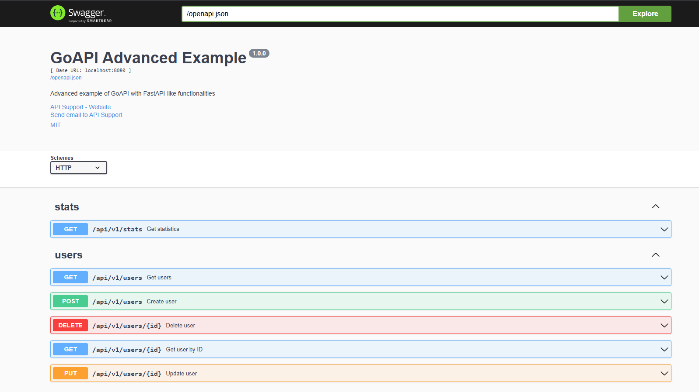

# GoAPI Framework for Go

GoAPI is a Go library that provides a FastAPI-like development experience for Python, with automatic validation, dependency injection, customizable middleware, and automatic documentation.




## 🚀 Key Features

- ✅ **Automatic data validation** (similar to Pydantic)
- ✅ **Built-in Dependency Injection**
- ✅ **Customizable middleware** (CORS, Rate Limiting, Authentication, etc.)
- ✅ **Standardized responses** with error handling
- ✅ **Automatic pagination**
- ✅ **Automatic Swagger/OpenAPI documentation**
- ✅ **Configurable rate limiting**
- ✅ **Centralized error handling**
- ✅ **Declarative syntax** similar to FastAPI

## 📦 Installation

```bash
go mod init your-project
go get github.com/esteban-ll-aguilar/goapi
```

## 🏃‍♂️ Quick Start

### Basic Example

```go
package main

import (
    "github.com/gin-gonic/gin"
    "github.com/esteban-ll-aguilar/goapi/goapi"
    "github.com/esteban-ll-aguilar/goapi/goapi/responses"
)

type User struct {
    ID   int    `json:"id" validate:"required,min=1"`
    Name string `json:"name" validate:"required,min=2,max=50"`
    Email string `json:"email" validate:"required,email"`
}

func main() {
    // Create configuration
    config := goapi.DefaultConfig()
    config.Title = "My API"
    config.Description = "An API created with GoAPI"
    
    // Create GoAPI instance
    api := goapi.New(config)
    
    // Define routes
    api.GET("/users", func(c *gin.Context) {
        users := []User{
            {ID: 1, Name: "John", Email: "john@example.com"},
            {ID: 2, Name: "Jane", Email: "jane@example.com"},
        }
        responses.Success(c, users)
    })
    
    // Run server
    api.Run(":8080")
}
```

### Example with Validation

```go
type CreateUserRequest struct {
    Name  string `json:"name" validate:"required,min=2,max=50"`
    Email string `json:"email" validate:"required,email"`
    Age   int    `json:"age" validate:"required,min=18,max=120"`
}

api.POST("/users", func(c *gin.Context) {
    var req CreateUserRequest
    if err := c.ShouldBindJSON(&req); err != nil {
        responses.BadRequest(c, "Invalid data format")
        return
    }
    
    // Automatic validation
    validator := validation.NewValidator()
    if err := validator.ValidateStruct(req); err != nil {
        validationErrors := validation.FormatValidationErrors(err)
        var responseErrors []responses.ResponseValidationError
        for _, ve := range validationErrors {
            responseErrors = append(responseErrors, responses.ResponseValidationError{
                Field:   ve.Field,
                Message: ve.Message,
                Value:   ve.Value,
            })
        }
        responses.ValidationError(c, responseErrors)
        return
    }
    
    // Create user
    user := User{ID: 1, Name: req.Name, Email: req.Email}
    responses.Created(c, user)
})
```

## 🛠️ Advanced Features

### Dependency Injection

```go
// Register dependencies
userService := NewUserService()
api.RegisterSingletonDependency(func(c *gin.Context) (interface{}, error) {
    return userService, nil
}, (*UserService)(nil))

// Use in handlers
api.GET("/stats", func(c *gin.Context) {
    var service *UserService
    if err := api.GetDependencyContainer().Resolve(c, &service); err != nil {
        responses.InternalServerError(c, "Error resolving dependencies")
        return
    }
    
    stats := service.GetStats()
    responses.Success(c, stats)
})
```

### Custom Middleware

```go
// CORS
api.AddCORS(middleware.CORSConfig{
    AllowOrigins: []string{"http://localhost:3000"},
    AllowMethods: []string{"GET", "POST", "PUT", "DELETE"},
})

// Rate Limiting
api.AddRateLimit(middleware.RateLimitConfig{
    RequestsPerMinute: 100,
    BurstSize:         10,
})

// Authentication
api.AddAuthentication("my-secret-key")

// Custom middleware
api.AddMiddleware(func(c *gin.Context) {
    // Your custom logic
    c.Next()
})
```

### Standardized Responses

```go
// Success responses
responses.Success(c, data)
responses.Created(c, newUser)
responses.NoContent(c)

// Error responses
responses.BadRequest(c, "Invalid data")
responses.NotFound(c, "User not found")
responses.Unauthorized(c, "Invalid token")
responses.InternalServerError(c, "Internal error")

// Paginated responses
responses.Paginated(c, items, total, page, pageSize)

// Validation responses
responses.ValidationError(c, validationErrors)
```

### Automatic Pagination

```go
api.GET("/users", func(c *gin.Context) {
    // Parse pagination parameters
    pageStr := c.DefaultQuery("page", "1")
    pageSizeStr := c.DefaultQuery("page_size", "10")
    
    page, _ := strconv.Atoi(pageStr)
    pageSize, _ := strconv.Atoi(pageSizeStr)
    
    // Get data
    users := userService.GetAll()
    total := len(users)
    
    // Apply pagination
    start := (page - 1) * pageSize
    end := start + pageSize
    if end > total {
        end = total
    }
    
    paginatedUsers := users[start:end]
    responses.Paginated(c, paginatedUsers, total, page, pageSize)
})
```

## 📚 Automatic Documentation

GoAPI automatically generates Swagger/OpenAPI documentation. You just need to add comments to your handlers:

```go
// GetUsers retrieves all users
// @Summary      Get users
// @Description  Retrieves a paginated list of users
// @Tags         users
// @Accept       json
// @Produce      json
// @Param        page      query     int     false  "Page number"
// @Param        page_size query     int     false  "Page size"
// @Success      200       {object}  responses.PaginatedResponse
// @Failure      400       {object}  responses.ErrorResponse
// @Router       /users [get]
func GetUsers(c *gin.Context) {
    // Your implementation
}
```

### Access Documentation

Once you run your API, you can access:

- **Swagger UI**: `http://localhost:8080/docs`
- **ReDoc**: `http://localhost:8080/redoc`
- **Main page**: `http://localhost:8080/`

## 🏗️ Project Structure

```
your-project/
├── main.go
├── go.mod
├── go.sum
└── handlers/
    ├── users.go
    └── auth.go
```

When using GoAPI as a library:

```go
import (
    "github.com/esteban-ll-aguilar/goapi/goapi"
    "github.com/esteban-ll-aguilar/goapi/goapi/middleware"
    "github.com/esteban-ll-aguilar/goapi/goapi/responses"
    "github.com/esteban-ll-aguilar/goapi/goapi/validation"
)
```

## 🔧 Advanced Configuration

### Custom Configuration

```go
config := goapi.APIConfig{
    Title:       "My Advanced API",
    Description: "An API with all features",
    Version:     "2.0.0",
    BasePath:    "/api/v2",
    Host:        "api.mydomain.com",
    Schemes:     []string{"https"},
    Debug:       false,
    Contact: goapi.Contact{
        Name:  "API Support",
        URL:   "https://mydomain.com/support",
        Email: "support@mydomain.com",
    },
    License: goapi.License{
        Name: "MIT",
        URL:  "https://opensource.org/licenses/MIT",
    },
}

api := goapi.New(config)
```

### Route Groups

```go
v1 := api.Group("/api/v1")
{
    users := v1.Group("/users")
    {
        users.GET("", GetUsers)
        users.GET("/:id", GetUser)
        users.POST("", CreateUser)
        users.PUT("/:id", UpdateUser)
        users.DELETE("/:id", DeleteUser)
    }
    
    posts := v1.Group("/posts")
    {
        posts.GET("", GetPosts)
        posts.POST("", CreatePost)
    }
}
```

## 📋 Available Validations

GoAPI uses go-playground/validator with support for:

- `required` - Required field
- `min=n` - Minimum value
- `max=n` - Maximum value
- `len=n` - Exact length
- `email` - Valid email format
- `url` - Valid URL
- `gte=n` - Greater than or equal to
- `lte=n` - Less than or equal to
- `oneof=val1 val2` - One of the specified values

### Complete Validation Example

```go
type User struct {
    ID       int    `json:"id" validate:"required,min=1"`
    Name     string `json:"name" validate:"required,min=2,max=50"`
    Email    string `json:"email" validate:"required,email"`
    Age      int    `json:"age" validate:"required,min=18,max=120"`
    Role     string `json:"role" validate:"required,oneof=admin user guest"`
    Website  string `json:"website,omitempty" validate:"omitempty,url"`
}
```

## 🚦 Available Middleware

### CORS
```go
api.AddCORS(middleware.CORSConfig{
    AllowOrigins:     []string{"*"},
    AllowMethods:     []string{"GET", "POST", "PUT", "DELETE"},
    AllowHeaders:     []string{"Origin", "Content-Type", "Authorization"},
    AllowCredentials: true,
})
```

### Rate Limiting
```go
api.AddRateLimit(middleware.RateLimitConfig{
    RequestsPerMinute: 60,
    BurstSize:         10,
})
```

### Authentication
```go
api.AddAuthentication("your-jwt-secret-key")
```

### Security Headers
```go
// Applied automatically
// X-Content-Type-Options: nosniff
// X-Frame-Options: DENY
// X-XSS-Protection: 1; mode=block
```

## 🔍 Comparison with FastAPI

| Feature | FastAPI (Python) | GoAPI (Go) |
|---------|------------------|------------|
| Automatic validation | ✅ Pydantic | ✅ go-playground/validator |
| Dependency Injection | ✅ | ✅ |
| Automatic documentation | ✅ Swagger/OpenAPI | ✅ Swagger/OpenAPI |
| Typed responses | ✅ | ✅ |
| Middleware | ✅ | ✅ |
| Rate Limiting | ✅ | ✅ |
| CORS | ✅ | ✅ |
| Pagination | ✅ | ✅ |
| Performance | Good | Excellent |

## 📖 Complete Examples

Check the `examples/` directory for complete examples:

- `examples/basic_example.go` - Basic usage example
- `examples/advanced_example.go` - Complete example with all features

## 🚀 Start Developing

1. **Install GoAPI**:
   ```bash
   go get github.com/esteban-ll-aguilar/goapi
   ```

2. **Create your first project**:
   ```go
   package main
   
   import (
       "github.com/esteban-ll-aguilar/goapi/goapi"
       "github.com/gin-gonic/gin"
   )
   
   func main() {
       api := goapi.New(goapi.DefaultConfig())
       
       api.GET("/hello", func(c *gin.Context) {
           c.JSON(200, gin.H{"message": "Hello from GoAPI!"})
       })
       
       api.Run(":8080")
   }
   ```

3. **Run your application**:
   ```bash
   go run main.go
   ```

4. **Visit the documentation**:
   - API: http://localhost:8080
   - Swagger: http://localhost:8080/docs
   - ReDoc: http://localhost:8080/redoc

## 🤝 Contributing

1. Fork the project
2. Create a feature branch (`git checkout -b feature/AmazingFeature`)
3. Commit your changes (`git commit -m 'Add some AmazingFeature'`)
4. Push to the branch (`git push origin feature/AmazingFeature`)
5. Open a Pull Request

## 📄 License

This project is licensed under the MIT License. See the `LICENSE` file for details.

## 🙏 Acknowledgments

- [FastAPI](https://fastapi.tiangolo.com/) for the inspiration
- [Gin](https://gin-gonic.com/) for the base web framework
- [go-playground/validator](https://github.com/go-playground/validator) for validation
- [Swagger](https://swagger.io/) for automatic documentation

## 📞 Support

If you have questions or need help:

<!--- Open an [Issue](https://github.com/esteban-ll-aguilar/goapi/issues)
- Check the [documentation](https://github.com/esteban-ll-aguilar/goapi/wiki) -->
- Contact the development team

---

**GoAPI** - Bringing FastAPI's simplicity to the Go ecosystem 🚀
